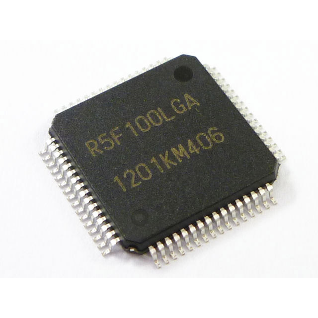

RL78
=========


## RL78 各ディレクトリー、及び概要など

これは RL78 と、そのコンパイラである rl78-elf-gcc,g++ によるプログラムです。
   
***RL78 の開発では、ルネサスエレクトロニクスが提供する統合開発環境を使う事も出来ますが、
永続的に使うには製品版を購入するか、生成したバイナリーが６４Ｋバイト以下に限られる為、
gcc を使います。   
また、Mac OS-X、Linux などのマルチプラットホームで開発出来る利便性も重視しています。
その他に、登録が必要な KPIT の開発ツールを使う事もできますが、自分の開発スタイルと
微妙に合いません、IDE があまり好きでは無いからです。***
   
現在は、主に「R5F100L」(G13 グループ) に対応した、ヘッダー、関連ライブラリーなどです。
   
・R5F100LCAFB (FLASH: 32K, RAM: 2K, DATA-FLASH:4K) @250   
・R5F100LEAFB (FLASH: 64K, RAM: 4K, DATA-FLASH:4K) @290   
・R5F100LGAFB (FLASH:128K, RAM:12K, DATA-FLASH:8K) @340 (変換基板実装済み @420)   
・R5F100LJAFB (FLASH:256K, RAM:20K, DATA-FLASH:8K) @400   
※ @xxx は、[秋月電子販売の参考価格](http://akizukidenshi.com/catalog/c/crl78g13/)
   
プロジェクトは、Makefile、及び、関連ヘッダー、ソースコードからなり、専用のスタートアップルーチン、
リンカースクリプトで構成されています。
その為、専用のブートプログラムやローダーは必要なく、作成したバイナリーをそのまま実行できます。   
これは、デバイスにハードウェアー・リセットが入力されて、自分のアプリケーションが動作するまでの
全てを詳細に公開してあり、判り易いものとなっています。   
   
デバイスＩ／Ｏ操作では、C++ で構成されたテンプレート・クラス・ライブラリーを使い、専用のヘッダー
と各種デバイス用のクラスライブラリーを用意してあり、最小限の実装で、高機能で柔軟な操作を実現する
べく、日々改良と研究を行っています。   
※未知のデバイス向けクラス・ライブラリーの提供を募集しています。（MIT ライセンスで提供出来る事）   
E-Mail: hira@rvf-rc45.net
   
## RL78 プロジェクト・リスト
   
 - /rl78prog        --->   RL78 フラッシュへのプログラム書き込みツール（Windows、OS-X、※Linux 対応）
 - /G13             --->   G13 グループ、リンカースクリプト、デバイス定義ファイル
 - /common          --->   RL78 共有クラス、小規模なクラスライブラリー、ユーティリティー
 - /chip            --->   各種デバイス用の制御クラスなど
 - /ff12a           --->   ChaN さん作成の「FatFS 0.12a」フレームワーク、と、RL78/G13 向けドライバー
 - /FIRST_sample    --->   RL78/G13 デバイス向け超簡単なサンプル（LED の点滅）
 - /UART_sample     --->   RL78/G13 デバイス向け、シリアル・コミュニケーションのサンプル（RxD0）
 - /INTERVAL_TIMER_sample ---> RL78/G13 内臓１２ビット、インターバル・タイマーのサンプル
 - /SOFT_DELAY_sample ---> RL78/G13 ソフトウェアー・タイマーのサンプル
 - /DS3231_sample   --->   RL78/G13 DS3231 I2C Real Time Clock の時間表示、設定サンプル
 - /DS1371_sample   --->   RL78/G13 DS1371 I2C Real Time Clock の時間表示、設定サンプル
 - /SDC_sample      --->   RL78/G13 SD カードの操作サンプル（SDカードのルートディレクトリーのリスト）
 - /INTERVAL_TIMER_TAU_sample ---> RL78/G13 TAU 利用インターバル・タイマー・サンプル
 - /PWM_sample ---> RL78/G13 TAU 利用 PWM 出力サンプル 
 - /WAV_PLAYER_sample ---> RL78/G13 WAV file 再生サンプル（PWM 変調による８ビット出力）
 - /VS1063_PLAYER_sample ---> RL78/G13 VS1063 Audio Decoder 再生サンプル
 - /BMP180_sample ---> RL78/G13 BMP180 I2C 圧力／温度センサー読み込み、表示サンプル
 - /ADC_sample ---> RL78/G13 内臓 A/D 変換サンプル
 - /ADC_SWITCH_sample ---> RL78/G13 シリーズ・スイッチ（４列）A/D 変換のサンプル
 - /ARITH_sample ---> RL78/G13 四則演算サンプル（文字列で数式を受け取り計算する）
 - /LCD_DOT_sample ---> RL78/G13 ST7565(R)/SSD1306 LCD コントローラー、グラフィックス表示サンプル
 - /TOUCH_sample ---> RL78/G13 タッチ・スイッチ、サンプル
 - /KiCAD_Lib       --->   KiCAD 用部品ライブラリー

FatFS LFN の有効／無効：   
SD カードのファイルシステム「fatfs」では、「LFN」（長いファイル名）を標準で使っており、表示は
UTF-8 を標準で使います。   
この場合、１２８ＫＢ以上のデバイスが必要です。   
これはメモリーを多く消費します、もし必要無いのであれば、「ff12a/src/ffconf.h」の「_USE_LFN」を
「０」にして、コンパイルすれば、文字列コードは OEM、（CP932 の場合 ShiftJIS）となり、最小限の
メモリー消費になります、長いファイル名も無効になり、8.3 形式になります。   
   
## RL78 開発環境準備（Windows、MSYS2）
   
 - Windows では、事前に MSYS2 環境をインストールしておきます。
 - MSYS2 には、msys2、mingw32、mingw64 と３つの異なった環境がありますが、msys2 で行います。 
   
 - msys2 のアップグレード

```sh
   update-core
```

 - コンソールを開きなおす。（コンソールを開きなおすように、メッセージが表示されるはずです）

```sh
   pacman -Su
```
 - アップデートは、複数回行われ、その際、コンソールの指示に従う事。
 - ※複数回、コンソールを開きなおす必要がある。

 - gcc、texinfo、gmp、mpfr、mpc、diffutils、automake、zlib tar、make、unzip コマンドなどをインストール
```sh
   pacman -S gcc
   pacman -S texinfo
   pacman -S mpc-devel
   pacman -S diffutils
   pacman -S automake
   pacman -S zlib
   pacman -S tar
   pacman -S make
   pacman -S unzip
   pacman -S zlib-devel
```
  
 - git コマンドをインストール
```sh
   pacman -S git
```

---

## RL78 開発環境準備（OS-X）

 - OS-X では、事前に macports をインストールしておきます。（brew は柔軟性が低いのでお勧めしません）
 -  OS−X のバージョンによっては、事前にX−Code、Command Line Tools などのインストールが必要になるかもしれません）

 - macports のアップグレード

```
   sudo port -d self update
```

 - ご存知とは思いますが、OS−X では初期段階では、gcc の呼び出しで llvm が起動するようになっています。
 - しかしながら、現状では llvm では、gcc のクロスコンパイラをビルドする事は出来ません。
 - そこで、macports で gcc をインストールします、バージョンは５系を使う事とします。
```
   sudo port install gcc5
   sudo ln -sf /opt/local/bin/gcc-mp-5  /usr/local/bin/gcc
   sudo ln -sf /opt/local/bin/g++-mp-5  /usr/local/bin/g++
   sudo ln -sf /opt/local/bin/g++-mp-5  /usr/local/bin/c++
```
 - 再起動が必要かもしれません。
 - 一応、確認してみて下さい。
```
   gcc --version
```
   
```
   gcc (MacPorts gcc5 5.4.0_0) 5.4.0
   Copyright (C) 2015 Free Software Foundation, Inc.
   This is free software; see the source for copying conditions.  There is NO
   warranty; not even for MERCHANTABILITY or FITNESS FOR A PARTICULAR PURPOSE.
```
   
 - texinfo、gmp、mpfr、mpc、diffutils、automake コマンドなどをインストール
```
   sudo port install texinfo
   sudo port install gmp
   sudo port install mpfr
   sudo port install libmpc
   sudo port install diffutils
   sudo port install automake
```

---
## RL78 開発環境準備（Ubuntu）

Linux 環境は、複数あるので、ここでは「Ubuntu 16.04 LTS」環境の場合を書いておきます。

 - texinfo、gmp、mpfr、mpc、diffutils、automake コマンドなどをインストール
```
   sudo apt-get install texinfo
   sudo apt-get install libgmp-dev
   sudo apt-get install libmpfr-dev
   sudo apt-get install libmpc-dev
   sudo apt-get install diffutils
   sudo apt-get install automake
   sudo apt-get install zlib1g-dev
```

---
## RL78 開発環境構築

 - RL78 用コンパイラ（rl78-elf-gcc,g++）は gcc-4.9.4 を使います。
 - binutils-2.25.1.tar.gz をダウンロードしておく
 - gcc-4.9.4.tar.gz をダウンロードしておく
 - newlib-2.2.0.tar.gz をダウンロードしておく
   
---
   
#### binutils-2.25.1 をビルド
```
   cd
   tar xfvz binutils-2.25.1.tar.gz
   cd binutils-2.25.1
   mkdir rl78_build
   cd rl78_build
   ../configure --target=rl78-elf --prefix=/usr/local/rl78-elf --disable-nls --with-system-zlib
   make
   make install     OS-X,Linux: (sudo make install)
```

 -  /usr/local/rl78-elf/bin へパスを通す（.bash_profile を編集して、パスを追加）

```
   PATH=$PATH:/usr/local/rl78-elf/bin
```

 -  コンソールを開きなおす。

```
   rl78-elf-as --version
```

 -  アセンブラコマンドを実行してみて、パスが有効か確かめる。
  
#### C コンパイラをビルド
``` sh
    cd
    tar xfvz gcc-4.9.4.tar.gz
    cd gcc-4.9.4
    mkdir rl78_build
	cd rl78_build
    ../configure --prefix=/usr/local/rl78-elf --target=rl78-elf --enable-languages=c --disable-libssp --with-newlib --disable-nls --disable-threads --disable-libgomp --disable-libmudflap --disable-libstdcxx-pch --enable-multilib --enable-lto --with-system-zlib
    make
    make install     OS-X,Linux: (sudo make install)
```
  
#### newlib をビルド
``` sh
    cd
    tar xfvz newlib-2.2.0.tar.gz
	cd newlib-2.2.0
    mkdir rl78_build
    cd rl78_build
    ../configure --target=rl78-elf --prefix=/usr/local/rl78-elf
	make
    make install     OS-X: (sudo make install)
```
 - Linux 環境では、sudo コマンドで、ローカルで設定した binutils のパスを認識しないので、
「make install」が失敗する、その為、以下のようなスクリプトを書いて実行する。
```
#!/bin/sh
# file: rl78_install.sh

PATH=${PATH}:/usr/local/rl78-elf/bin
make install
```
   
```
    sudo rl78_install.sh
```
---  
#### C++ コンパイラをビルド
``` sh
    cd
    cd gcc-4.9.4
    cd rl78_build
    ../configure --prefix=/usr/local/rl78-elf --target=rl78-elf --enable-languages=c,c++ --disable-libssp --with-newlib --disable-nls --disable-threads --disable-libgomp --disable-libmudflap --disable-libstdcxx-pch --enable-multilib --enable-lto --with-system-zlib
    make
    make install     OS-X,Linux: (sudo make install)
```
   
---
   
# 注意　注意　注意
   
OS-X、Linux では、各プロジェクトをビルドする際に、「Makefile」内で設定している   
最適化オプション「-flto」を外して下さい。   
   
そうしないと、動作しない実行バイナリーが生成されます。   
※MSYS2 でビルドした場合には、これは起こりません。
   
具体的には、参照されない関数アドレスなどが格納されたセクションの情報が一切出力   
されていません。   
現在、対処法を検討中です。   
   
## RL78 プロジェクトのソースコードを取得

```
   git clone git://github.com/hirakuni45/RL78.git
```
   
 - プロジェクトを全てコンパイル
```
   sh all_project_build.sh
```
   
--- 
   
## RL78/G13 デバイスへのプログラム書き込み方法

幾つかの方法がありますが、最も簡単で、コストがかからない方法は、シリアルインターフェースを使って
書き込む方法です。   
但し、Ｒ８Ｃのように直接接続する事は出来ません。
シリアルインターフェースからの３つ（５つ）の信号を適切な変換回路でマイコンと接続する必要があります。   
※USB シリアル変換モジュールなどを使うと、電源も取れて簡単です。   
※（秋月電子、シリアル変換モジュール）http://akizukidenshi.com/catalog/g/gK-06894/   
(1) RXD シリアル受信   
(2) TXD シリアル送信   
(3) RTS ハードウェアー制御信号   
(4) VCC 電源（５Ｖ又は３．３Ｖ）   
(5) GND 電源 ０Ｖ   
※３．３Ｖは限られた電流しか取り出せない為、レギュレーターを入れる事を推奨します。   
※ RTS 信号が取り出せる変換アダプターが必要です、DCD 信号では代用できません。   
※中国製の格安なモジュールは、RTS が無い物や、品質が安定していない為、お勧めしません、それらの事
項を理解していて対処出来る人だけ利用すると良いと思います。
   
 - 回路図は、rl78prog/KiCAD/ を参照して下さい、簡易書き込み回路があります。   
 - 正規の回路は、ルネサスエレクトロニクスのホームページからダウンロード出来ます。
 - もちろん、ルネサスエレクトロニクス販売のＥ１、又は、Ｅ２、エミュレーターでも書き込む事が出来ます。
 - RL78/G13（６４ピン製品） の「P40/TOOL0 (5)」、「/RESET (6)」に接続します。
 - シリアル通信は、開発過程では良く利用するので、スイッチで切り替えられるようにしておくと便利です。   
※切り替えの参考回路が、「rl78prog/KiCAD」にあります。   
   
## RL78 フラッシュプログラマーの構築

 - rl78prog のビルドには「boost_1_60_0」が必要です。（MSYS2 環境の場合）
 - Windows 以外の環境では、「port」、「apt-get」を使ってインストールして下さい。
 - USB シリアルチップが、FTDI の場合、OS-X、Linux では、標準のドライバーでは、動作しません。
 - また、OS-X では、OS のバージョンによっては、FTDI のドライバーインストールに工夫が必要です。
 - その他の USB シリアルチップの場合は調査していません。
 - boost はヘッダーのみ利用なので、ビルドの必要はありません、boost_1_60_0.zip を展開するだけです。
``` 
    cd /usr/local
    unzip boost_1_60_0.zip
```

 - rl78prog のビルド（MSYS2）
 - ビルドした実行ファイルは、/usr/local/bin に配置します。

``` sh
    cd rl78prog
    make
    make install
　　※ /usr/local/bin にパスを通しておく。
```
 - rl78_prog.conf を編集して、接続する COM ポート、ボーレートの設定をする。
 - ボーレートは、RL78 の仕様と termios の制限から「115200」、「500000」、「1000000」のみ対応しています。
 - /dev/ttyS10 -> COM11 に相当します。（数字に＋１する）
 - rl78prog/KiCAD/ に、RL78 プログラマー（書き込み機）の参考回路などが含まれます。
  
---
## ＲＬ７８特有の制限と解決方法
   
RL78 は一応は、16ビットマイコンに分類されていますが、厳密には違うと思います。   
基本は 8 ビットマイコンと何ら変わりなく、アドレス空間が広い 8 ビットと言えます。   
C や C++ のプログラムを作成する場合に注意する点は、ポインターは基本 16 ビットで、   
64K バイトの空間しかアクセス出来ません、特殊な場合、__far ポインターを使えますが   
命令の効率が悪く、特殊な用途に絞って使う事ができます。   
※FatFS を使用した場合の、UTF-8 と CP932 の変換テーブルなどを、ROM Flash 領域の   
後半に配置して、 __far ポインターによりアクセスしています。
   
プログラムカウンターは、20 ビットに拡張されており、1M バイトの領域で動作します。   

RAM や I/O 領域は、0xF0000 以降にアサインされており、この領域のアクセスでは、上位   
4 ビットが固定されたアドレッシングモードを使い、16 ビットのアクセスを行う為、   
コンパイラは、20 ビットの領域にアクセスしているように振る舞いますが、実際は、16   
ビットの領域しかアクセス出来ません。
※詳しくは、「ミラー領域」の説明を観て下さい。
   
ルネサス・エレクトロニクスでは、内臓データフラッシュへの書き込みに必要な資料を   
公開していません、また、gcc 用のデータフラッシュライブラリの提供もしていません   
従って、現状では、内部データフラッシュを利用する事は出来ません。
何か、データを記憶したい場合は、I2C 接続の EEPROM を活用するなどの方法が考えられます。   
   
## 各プロジェクトの動作と秘訣

 - 各プロジェクトのリストを参考に、プロジェクトのディレクトリーに移動します。
 - 各プロジェクトは、「R5F100LGAFB」（ProgramFlash: 128KB、RAM: 12KB、DataFlash: 8KB）がデフォルトとなっています。
 - Makefile 内で、他のデバイスに変更する事が出来ます。※ワーク RAM サイズが違うので必ず合わせる必要があります。
 - 基本的には、内部発振を使い 32MHz で動作させています。
 - 動作周波数を変更したい場合は、同時に Makefile 内の F_CLK を指定する必要があります。   
 - 現状では、ソフトウェアーディレイは３２ＭＨｚにしか対応していません。   
 - より正確なクロックで動かしたい場合、外部にクリスタルを接続し、外部発振を有効にすれば、使う事ができます。
 - 但し、最大２０ＭＨｚまでのクリスタル、又は外部クロックにしか対応しません。
 - 起動時の動作周波数設定は、common/option_bytes.c で行っています。
 - C++ のテンプレートを多用しているので、バイナリーは大きくなりがちです。
 - サイズを優先して最適化したい場合は「-Os」を指定する事で、バイナリーが小さくなります。
 - 「-Os」を指定する場合、「-flto」を追加する必要があります。（gcc のバグと思われる）
 - 「R5F100LGAFB」は、変換基板にハンダ付けされた物が格安で入手出来ます。（秋月電子）
 - 結線に関しては、RL78/G13 ハードウェアー・マニュアルを参照して下さい。
 - 基本的には電源を繋ぎ、適切なバイパスコンデンサを繋ぐだけで動作します。
 - 特別（複雑な場合）な接続を要求する場合は、KiCAD のプロジェクトファイルを用意しています。
   
---
 - ビルドします。（自動で、従属規則が生成されます）
``` sh
    make
```

 - プログラムの書き込み（rl78_prog が必要）
``` sh
    make run
```
---
## 新規プロジェクトの作成
 - 新規プロジェクト・ディレクトリーを作成します。
 - TMPtestなどから、雛形に使う「Makefile」、「main.cpp」をコピーします。
 - Makefile の必要な部分を書き換えて、自分のプロジェクト用にします。
 - Makefile 内のソースコードパスに、自分のソースコード名を追加する事が出来ます。
 - Makefile では「従属規則」が重要ですが、これは自動で生成します。

## 各ファイル概略
 - G13/R5F100LCAFB.ld　R5F100LCAFB ( 32K/ 2K/4K) 用リンカースクリプト   
 - G13/R5F100LEAFB.ld　R5F100LEAFB ( 64K/ 4K/4K) 用リンカースクリプト   
 - G13/R5F100LGAFB.ld　R5F100LGAFB (128K/12K/8K) 用リンカースクリプト   
 - G13/R5F100LJAFB.ld　R5F100LJAFB (256K/20K/8K) 用リンカースクリプト   
 - G13/readme.txt　リンカースクリプトの概略
 - G13/adc.hpp　Ａ／Ｄコンバーター定義
 - G13/dma.hpp　ＤＭＡコントローラー定義
 - G13/iica.hpp　ＩＩＣＡ（Ｉ２Ｃ）定義
 - G13/intr.hpp　割り込み制御関係定義
 - G13/port.hpp　ポート関係定義
 - G13/sau.hpp　シリアル・アレイ・ユニット定義
 - G13/system.hpp　システム関係定義
 - G13/tau.hpp　タイマ・アレイ・ユニット定義
 - G13/timer.hpp　１２ビットインターバルタイマー定義
   
---
 - chip/chip_list.txt　チップ・リスト
 - chip/BMP180.hpp　BOSHE BMP180 温度、圧力センサー・ドライバー
 - chip/DS3231.hpp　Maxim DS3231 RTC リアルタイムクロック・ドライバー
 - chip/DS1371.hpp　Maxim DS1371 RTC リアルタイムクロック・ドライバー（３２ビット、バイナリー・カウンター）
 - chip/EEPROM.hpp　I2C 接続 EEPROM ドライバー
 - chip/MPU6050.hpp　InvenSense 加速度、ジャイロ・センサー・ドライバー
 - chip/ST7565.hpp　LCD 単色、ドットマトリックス・ドライバー
 - chip/SSD1306.hpp OLED 単色、ドットマトリックス・ドライバー
 - chip/VS1063.hpp　MP3 / OGG VORBIS エンコーダー、デコーダー・ドライバー
   
---
 - common/start.s　ハードウェアー・リセット初期化
 - common/init.c　main 初期化
 - common/option_bytes.hpp　オプション・バイト設定
 - common/vect.h　ハードウェアー・ベクター定義
 - common/vect.c　ハードウェアー・ベクター設定
 - common/time.h　時間関数定義（posix time.h にある機能の縮小版）
 - common/time.c　時間関数実装（posix time.c にある機能の縮小版）
 - common/io_utils.hpp　I/O 制御テンプレート・ユーティリティー
 - common/adc_io.hpp　A/D 変換制御テンプレート
 - common/basic_arith.hpp  四則演算入力クラス
 - common/bitset.hpp  ビット・パック簡易テンプレート・クラス（std::bitset の縮小セット）
 - common/command.hpp　行入力テンプレート
 - common/csi_io.hpp　CSI(SPI) 変換制御テンプレート
 - common/delay.hpp　ソフトウェアー・ディレイ（３２ＭＨｚ動作、マイクロ秒単位）
 - common/fifo.hpp　First-in first-out バッファ
 - common/filer.hpp　ビットマップ・グラフィックス用ファイル選択
 - common/font6x12.hpp　6x12 ピクセル、ASCII フォント・クラス（定義）
 - common/font6x12.cpp  6x12 ピクセル、ASCII フォント・クラス（実体）
 - common/format.hpp　文字列整形テンプレート
 - common/iica_io.hpp　ＩＩＣＡ入出力テンプレート
 - common/itimer.hpp　インターバル・タイマー制御テンプレート
 - common/kfont12.bin　１２ピクセル漢字フォントビットマップデータ
 - common/kfont12.hpp　１２ピクセル漢字フォント・クラス
 - common/monograph.hpp　ビットマップ・グラフィックス制御クラス
 - common/port_utils.hpp　ポート・ユーティリティー
 - common/sdc_io.hpp　ＳＤカード制御クラス
 - common/string_utils.hpp  文字列ユーティリティー（コード変換など）
 - common/switch_man.hpp  スイッチ・マネージメントクラス
 - common/task.hpp　タスク制御（無効タスククラス）
 - common/tau_io.hpp　タイマー制御テンプレート
 - common/uart_io.hpp　シリアル・コミュニケーション入出力（ＵＡＲＴ）
   
---
License

MIT
