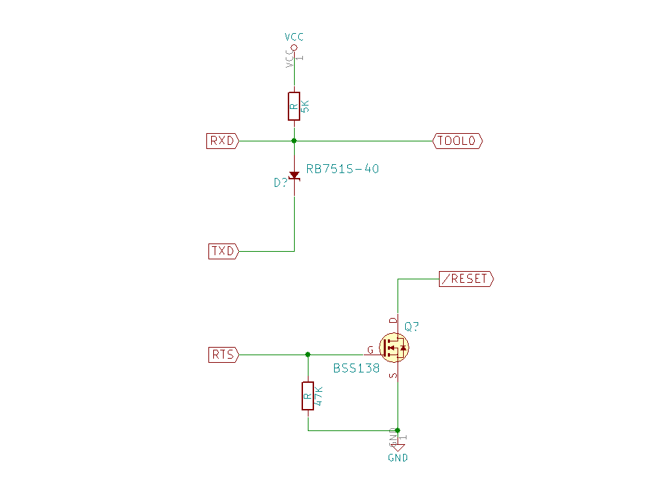

RL78
=========


[Japanese](READMEja.md)

## RL78 directories, overview, etc.

This is a program by RL78 and its compiler, rl78-elf-gcc,g++.
   
***For RL78 development, you can use the integrated development environment provided by Renesas Electronics, but for permanent use, you need to purchase the commercial version or generate your own.   
However, you need to purchase the commercial version to use it permanently, or you need to purchase the integrated development environment for RL78 because the generated binaries are limited to 64 Kbytes or less.   
Also, since it does not support C++, use gcc.   
We also emphasize the convenience of development on multiple platforms, such as Mac OS-X and Linux.   
I can also use [Open Source Tools for Renesas](https://llvm-gcc-renesas.com/)'s development tools, which require registration, but they don't fit my development style.   
I don't like IDEs very much. ***
   
Currently, I mainly provide headers, related libraries, etc. for "R5F100L" (G13 group).
   
R5F100LCAFB (FLASH: 32K, RAM: 2K, DATA-FLASH: 4K) @250 yen   
R5F100LEAFB (FLASH: 64K, RAM: 4K, DATA-FLASH:4K) @290 yen   
R5F100LGAFB (FLASH:128K, RAM:12K, DATA-FLASH:8K) @340 yen (conversion board already mounted @420 yen)   
R5F100LJAFB (FLASH:256K, RAM:20K, DATA-FLASH:8K) @400 yen   

@xxx is [reference price for Akizuki Denshi sales](http://akizukidenshi.com/catalog/c/crl78g13/)
   
The project consists of Makefile, related headers, and source code, and is composed of dedicated startup routines, linker scripts
It consists of a dedicated startup routine and a linker script.
Therefore, no dedicated boot program or loader is required, and the binaries you create can be executed as is.   
This means that you can run your application as is, without the need for a dedicated boot program or loader.
The entire process from the hardware reset to the device and your application running is detailed and easy to understand.   

***The most common case is that the compiler has been modified to switch functions dynamically, internally. ***   
***You can build a practical environment with only gcc and make without such a step. ***   
   
For device I/O operations, a template class library composed in C++ is used, and dedicated headers and class libraries for various devices are prepared.   
We are constantly improving and researching to realize highly functional and flexible operations with minimal implementation.   
We are looking for class libraries for unknown devices. (Must be able to provide under MIT license)   
E-Mail: hira@rvf-rc45.net
   

## RL78 Project List

|directory|contents|
|---|---|
|rl78prog|Programming tool to write programs to RL78 flash|
|G13|G13 group, linker scripts, device definition files|
|common|RL78 shared classes, small class library, utilities|
|chip|control classes for various devices, etc.||
|ff12a|"FatFS 0.12a" framework created by ChaN, and RL78/G13 SPI|
|KiCAD_Lib|Parts library for KiCAD|
|data_flah_lib|GR-Cotton/GR-Kurumi data/flash operation library|
|FIRST_sample|Super simple sample (blinking LED) for RL78/G13 devices|
|SOFT_DELAY_sample|Software timer sample for RL78/G13 devices|
|UART_sample|Serial communication sample for RL78/G13 devices|
|ARITH_sample|RL78/G13 Four arithmetic operations sample (receive and calculate mathematical expression by string)|
|ADC_sample|RL78/G13 internal A/D conversion sample|
|ADC_SWITCH_sample|RL78/G13 series switch (four rows) A/D conversion sample|
|THERMISTOR_sample|RL78/G13 Thermistor temperature display sample (using A/D conversion)|
|TOUCH_sample|RL78/G13 touch switch, sample|
|DATA_FLASH_sample|RL78/G13 Data flash sample (read, write, erase)
|INTERVAL_TIMER_sample|RL78/G13 internal 12-bit, interval timer samples|
|INTERVAL_TIMER_TAU_sample|RL78/G13 TAU use interval timer sample|
|EEPROM_sample|RL78?G13 EEPROM I2C Read/Write sample|
|DS3231_sample|RL78/G13 DS3231 I2C Real Time Clock time display and setting sample|
|DS1371_sample|RL78/G13 DS1371 I2C Real Time Clock time display, setting sample|
|BMP180_sample|RL78/G13 BMP180 I2C Pressure/Temperature sensor reading and display sample|
|VL53L0X_sample|RL78/G13 VL53L0X I2C Time-of-Flight distance sensor, sample|
|PWM_sample|RL78/G13 TAU use PWM output sample| 
|SDC_sample|RL78/G13 SD card operation sample (SD card root directory list)||
|WAV_PLAYER_sample|RL78/G13 WAV file playback sample (8-bit output by PWM modulation, up to 48KHz/16bits)
|VS1063_PLAYER_sample|RL78/G13 VS1063 Audio Decoder Playback sample
|LCD_DOT_sample|RL78/G13 ST7565(R)/SSD1306 SPI LCD controller, graphics display sample|
|MAX6675_sample|RL78/G13 MAX6675 SPI K thermocouple, temperature display sample|
|MAX7219_sample|RL78/G13 MAX7219 SPI LED display sample|

### Enable/Disable FatFS LFN   
The SD card file system "fatfs" uses "LFN" (long file name) as standard and displays UTF-8 is used as standard.    (UTF-8 and Shift-JIS conversion tables are available.)   
This requires a device of at least 128KB.   
This consumes a lot of memory. If you do not need it, set "_USE_LFN" in "ff12a/src/ffconf.h" to "0" and compile it.   
If you do not need it, you can compile the file with "_USE_LFN" set to "0" in "ff12a/src/ffconf.h" and the string code will be OEM, (ShiftJIS for CP932), with minimal Long file names are also disabled, and 8.3 format is used.   
   
## Preparation of RL78 development environment (Windows, MSYS2)
   
 - On Windows, install the MSYS2 environment beforehand.
 - There are three different MSYS2 environments: msys2, mingw32, and mingw64. 

 - Upgrading msys2

````
   pacman -Sy pacman
   pacman -Syu
````

 - Reopen the console. (You should see a message telling you to reopen the console.)

```
   pacman -Su
```
 - The update will be performed multiple times, and you must follow the console's instructions.
 - You will need to reopen the console multiple times.

 - Install gcc, texinfo, gmp, mpfr, mpc, diffutils, automake, zlib tar, make, unzip commands, etc.
````
   pacman -S gcc
   pacman -S texinfo
   pacman -S mpc-devel
   pacman -S diffutils
   pacman -S automake
   pacman -S zlib
   pacman -S tar
   pacman -S make
   pacman -S unzip
   pacman -S zlib-devel
````
  
 - Install git commands
```
   pacman -S git
```

---

## Preparation of RL78 development environment (OS-X)

 - For OS-X, install macports beforehand. (Brew is not recommended due to its inflexibility.)
 - (Depending on the OS-X version, you may need to install X-Code, Command Line Tools, etc. beforehand.)

 - Upgrading macports

```
   sudo port -d self update
```

 - As you probably know, in OS-X, llvm is initially invoked by gcc calls.
 - However, llvm is currently unable to build gcc cross-compilers.
 - So, we will install gcc with macports, and we will use the version 5 series.

```
   sudo port install gcc5
   sudo ln -sf /opt/local/bin/gcc-mp-5 /usr/local/bin/gcc
   sudo ln -sf /opt/local/bin/g++-mp-5 /usr/local/bin/g++
   sudo ln -sf /opt/local/bin/g++-mp-5 /usr/local/bin/c++
```

 - You may need to reboot.
 - Just to make sure.

```
   gcc --version
```
   
```
   gcc (MacPorts gcc5 5.4.0_0) 5.4.0
   Copyright (C) 2015 Free Software Foundation, Inc.
   This is free software; see the source for copying conditions.
   warranty; not even for MERCHANTABILITY or FITNESS FOR A PARTICULAR PURPOSE.
```
   
 - Install texinfo, gmp, mpfr, mpc, diffutils, automake commands, etc.
```
   sudo port install texinfo
   sudo port install gmp
   sudo port install mpfr
   sudo port install libmpc
   sudo port install diffutils
   sudo port install automake
```

---
## Preparation of RL78 development environment (Ubuntu)

Since there are multiple Linux environments, I will write about the "Ubuntu 16.04 LTS" environment here.

 - Install texinfo, gmp, mpfr, mpc, diffutils, automake commands, etc.
```
   sudo apt-get install texinfo
   sudo apt-get install libgmp-dev
   sudo apt-get install libmpfr-dev
   sudo apt-get install libmpc-dev
   sudo apt-get install diffutils
   sudo apt-get install automake
   sudo apt-get install zlib1g-dev
```

---
## Build RL78 development environment

 - Use gcc-4.9.4 as the compiler for RL78 (rl78-elf-gcc,g++).
 - Download binutils-2.25.1.tar.gz
 - Download gcc-4.9.4.tar.gz
 - Download newlib-2.2.0.tar.gz

---
   
#### build binutils-2.25.1

```
   cd
   tar xfvz binutils-2.25.1.tar.gz
   cd binutils-2.25.1
   mkdir rl78_build
   cd rl78_build
   ... /configure --target=rl78-elf --prefix=/usr/local/rl78-elf --disable-nls --with-system-zlib
   make
   make install OS-X,Linux: (sudo make install)
```

 - Pass /usr/local/rl78-elf/bin (edit .bash_profile and add the path)

```
   PATH=$PATH:/usr/local/rl78-elf/bin
```

 - Reopen the console.

```
   rl78-elf-as --version
```

 - Run the assembler commands to see if the path is valid.

#### build C Compiler
```
    cd
    tar xfvz gcc-4.9.4.tar.gz
    cd gcc-4.9.4
    mkdir rl78_build
	cd rl78_build
    ../configure --prefix=/usr/local/rl78-elf --target=rl78-elf --enable-languages=c --disable-libssp --with-newlib --disable-nls --disable-threads --disable-libgomp --disable-libmudflap --disable-libstdcxx-pch --disable-multilib --enable-lto --with-system-zlib
    make
    make install     OS-X,Linux: (sudo make install)
```
  
#### build newlib

```
    cd
    tar xfvz newlib-2.2.0.tar.gz
	cd newlib-2.2.0
    mkdir rl78_build
    cd rl78_build
    ../configure --target=rl78-elf --prefix=/usr/local/rl78-elf
	make
    make install     OS-X: (sudo make install)
```

 - Under Linux, the sudo command does not recognize the path to the binutils locally configured, so "make install" fails.   
Therefore, the following script should be written and executed.

```
#!/bin/sh
# file: rl78_install.sh

PATH=${PATH}:/usr/local/rl78-elf/bin
make install
```
   
```
    sudo rl78_install.sh
```
---  
#### build C++ Compiler
```
    cd
    cd gcc-4.9.4
    cd rl78_build
    ../configure --prefix=/usr/local/rl78-elf --target=rl78-elf --enable-languages=c,c++ --disable-libssp --with-newlib --disable-nls --disable-threads --disable-libgomp --disable-libmudflap --disable-libstdcxx-pch --disable-multilib --enable-lto --with-system-zlib
    make
    make install     OS-X,Linux: (sudo make install)
```
   
---
   
# Attention
   
In OS-X and Linux, remove the optimization option "-flto" set in the "Makefile" when building each project.   
Remove the optimization option "-flto" from the "Makefile" when building each project.   
   
Otherwise, an executable binary that does not work will be generated.   
This does not happen when building with *MSYS2.
   
Specifically, no information in the section containing unreferenced function addresses, etc., is output.   
We are currently investigating a workaround.   
We are currently investigating a workaround.   

At present, there is little benefit to be gained from "-flto", so for safety reasons, we have decided to build without this option in all environments.   
option in all environments to be safe.   
   
---

## RL78 プロジェクトのソースコードを取得

```
   git clone https://github.com/hirakuni45/RL78.git
```
   
 - プロジェクトを全てコンパイル
```
   sh all_project_build.sh
```
   
--- 

## How to write a program to an RL78/G13 device

There are several ways to write a program to an RL78/G13 device, but the easiest and least expensive way is to use the serial interface
The easiest and least expensive way is to use a serial interface to write the program.   
However, it is not possible to connect directly like R8C.   
However, it is necessary to connect 3 (5) signals from the serial interface to the microcontroller with an appropriate conversion circuit.   
Using a USB serial conversion module, for example, is easy because it can also be powered.   
*(Akizuki Denshi, serial conversion module) http://akizukidenshi.com/catalog/g/gK-06894/   
(1) RXD Serial receive   
(2) TXD Serial transmit   
(3) RTS Hardware control signal   
(4) VCC Power supply (5V or 3.3V)   
(5) GND Power supply 0V   
Since only a limited current can be drawn from 3.3V, it is recommended to use a regulator.   
A conversion adapter that can take out the RTS signal is required.   
We do not recommend cheap modules made in China because they do not have RTS or their quality is not stable.   
Only those who understand and can deal with these issues should use these modules.  


   
- See rl78prog/KiCAD/ for schematics and a simplified write circuit.   
 - The official circuit can be downloaded from the Renesas Electronics website.   
 - Of course, you can also write with Renesas Electronics E1, E2, and emulators.
 - Connect to "P40/TOOL0 (5)" and "/RESET (6)" of RL78/G13 (64-pin product).
 - Serial communication is often used in the development process, so it is convenient to be able to switch between them with a switch.   

A reference circuit for switching is available in "rl78prog/KiCAD".   
It is possible to write with a serial conversion circuit at a very high speed, so it may be better to purchase a new E1 for the RL78 for cost consideration.   
It may be better to consider the cost of purchasing a new E1 for the RL78.  
Currently, writing is only possible in the Windows environment.    

## Building RL78 flash programmer

 - boost_1_60_0" is required to build rl78prog. (For MSYS2 environment)
 - In non-Windows environment, use "port" or "apt-get" to install.
 - If the USB serial chip is FTDI, the standard driver does not work on OS-X and Linux.
 - Also, on OS-X, depending on the OS version, you may need to make a special effort to install the FTDI driver.
 - We have not investigated other USB serial chips.
 - Since boost uses only headers, it does not need to be built.
 - I use pacman to install boost in a mingw64 environment, for example.
 
``` 
    pacman -S mingw-w64-x86_64-boost
```

 - Build rl78prog (MSYS2)
 - Place the built executable in /usr/local/bin.

```
    cd rl78prog
    make
    make install
　　Put the path to /usr/local/bin.
```
 - Edit rl78_prog.conf and set the COM port and baud rate.
 - Only "115200", "500000", and "1000000" baud rates are supported due to the RL78 specification and termios limitations.
 - Equivalent to /dev/ttyS10 -> COM11. (+1 to the number)
 - rl78prog/KiCAD/ contains reference circuits for RL78 programmer (writing machine), etc.

 - Serial devices confirmed to work   
   
||FT231X|CP2102|CH340|
|---|:---:|:---:|:---:|
|Windows |○ |○ |△ |
|OS-X |× |× |△ |
|Linux |x |x |△ |△ |
   
○：Confirmed operation, △：Unconfirmed, ×：Malfunction   

Although the writing software is multi-platform compatible, currently it can only be used in a Windows environment.   
The writing software is multi-platform, but currently only works in Windows environment.   
  
---
## RL78-specific limitations and solutions
   
RL78 is classified as a 16-bit microcontroller, but strictly speaking, it is not.   
Basically, it is no different from an 8-bit microcontroller, and can be said to be an 8-bit microcontroller with a large address space.   
When writing C or C++ programs, it is important to note that the pointer is basically 16 bits, and only 64K bytes of space can be accessed.   
In special cases, the __far pointer can be used, but it is not efficient.   
In special cases, the __far pointer can be used, but it is less efficient and can be used only for special purposes.   
In the case of using FatFS, the conversion table between UTF-8 and CP932 can be placed in the latter half of the ROM Flash area, and the __far_ pointer can be used to access the 64K byte space.   
The program counter is extended to 20 bits.   
   
The program counter is extended to 20 bits and operates in a 1M-byte area.   

The RAM and I/O areas are assigned to 0xF0000 and after, and access to these areas requires the use of an addressing address whose upper 4 bits are fixed.   
The compiler can access a 20-bit area by using an addressing mode in which the upper 4 bits are fixed and a 16-bit access is performed.   
The compiler acts as if it is accessing a 20-bit area, but in fact it can only access a 16-bit area.   
In reality, only a 16-bit area can be accessed.   
For more information, see the explanation of "Mirror Area.   
   
Renesas Electronics has not released the documentation required to write to the internal data flash.   
Renesas Electronics does not provide the necessary documentation for writing to the internal data flash, nor does it provide a data flash library for gcc.   
~~Therefore, it is not possible to use the internal data flash in the current situation.~~  
~~If you want to store some data, you can use EEPROM with I2C connection.~~   
GR-Cotton and GR-Kurumi use RL78/G13, and the WEB compiler is gcc.   
The situation has changed since we found out that the RL78/G13 is used in GR-Cotton and GR-Kurumi, and that the data flash library (gcc version of PFDL T4) can be used.   
Now, data flash operation can be performed normally.   
   
## How each project works and secrets
   
 - Currently, the project may not be well maintained and may be committed in a halfway state.   
 - If it does not work, please contact us as there may be a problem with the program.   
 - Refer to the list of each project and go to the directory of the project.   
 - Each project defaults to "R5F100LGAFB" (ProgramFlash: 128KB, RAM: 12KB, DataFlash: 8KB).
 - It can be changed to other devices in the Makefile. The work RAM sizes are different and must be matched.
 - Basically, the device operates at 32 MHz using an internal oscillator.
 - If you want to change the operating frequency, you need to specify F_CLK in the Makefile at the same time.   
 - Currently, the software delay only supports 32MHz.   
 - If you want to use a more accurate clock, you can connect an external crystal and enable external oscillation.
 - However, the software only supports crystals up to 20 MHz or external clocks.   
 - The operating frequency setting at startup is done in common/option_bytes.c.   
 - Since C++ templates are used extensively, binaries tend to be large.   
 - If you want to optimize the binary with priority on size, specify "-Os" to make the binary smaller.   
 - When "-Os" is specified, *"-flto" should not be used in the current situation. (It seems to be a bug in gcc.)   
 - R5F100LGAFB" is available soldered on a conversion board at a reasonable price. (Akizuki Denshi)   
 - Please refer to the RL78/G13 hardware manual for wiring.
 - Basically, just connect the power supply and appropriate bypass capacitors.   
 - If you require special (complicated) connections, KiCAD project files are available.     
   
### Interrupt Precautions

 - UART, timers, etc., interrupt entries, be up-to-date!
 - Basically, the base entries are defined in vect.h and vect.c.
 - On the main side, use the entries defined in the base as an implementation of C language functions.
 - On the main side, the interrupt entry always includes "renesas.hpp".
 - The "renesas.hpp" contains the definitions of the attributes of the interrupt entries.
 - Without the definition in "renesas.hpp", the interrupt entry will function as a normal function and will not work.
 - For functions defined using "__attribute__((weak))", the redefinition side takes precedence.
 - The header side has "INTERRUPT_FUNC;" appended and functions as an interrupt handler.
 - The interrupt task in each driver template is a normal function since it is assumed to be called by the interrupt handler.
 - Note that typoing the entry name will not cause an error, it will just exist as an invalid function.
 - **Interrupt handler typos, problems caused by forgetting to include "renesas.hpp" are difficult to find. **
   
### Notes on data flash operations

 - As a standard, the link file is made on the assumption that the Renesas PFDL-T4 library is used.
 - For details, please refer to the documents related to [PFDL-T4](https://www.renesas.com/ja-jp/software/D3016252.html).
 - The work area of the library is reserved in the second half of RAM. (136 bytes)
 - If you do not use the library and want a little RAM, you can modify the link file.
 - Be careful when modifying the gcc link file.
   
### incorporation and configuration of common/syscalls.c

 - syscalls contains the required POSIX implementation. (not all).
 - The main ones are stdout and stdin. （The main ones are stdout, stderr, and stdin.)
 - In addition, file operations are included if the SD card file system is incorporated.
 - Standard I/O can be assigned as serial I/O in main.cpp.
 - To do so, implement "sci_putch, sci_getch".
 - To incorporate the SD file system, define the interface with FatFS.
 - Refer to "main.cpp of SDC_sample".
 - OPEN_MAX_" in "syscalls.c" limits the number of files that can be opened simultaneously.
 - Currently, up to 3 files can be open at the same time.
 - The number can be increased, but this will reduce the work RAM area.
 - When using the SD file system, a device with a FLASH area of 128K or more is recommended.
   
### Using format instead of printf

 - By including syscalls.c, you can automatically use the printf function.
 - However, it is not recommended.
 - The printf argument is stack-based, and inconsistencies can lead to very fickle behavior.
 - Basically, in C++, there is no reason to use printf, which is convenient but highly dangerous.
 - Instead, use utils::format.hpp, which offers similar functionality and convenience.
 - Instructions are included in the examples.
 - Instead of scanf, utils::input.hpp is provided.
   
---

 - Build. (It will automatically generate the dependency rules for you.)

```
    make
```

 - write the program (requires rl78_prog)

```
    make
    make run
```

---

## create new project

 - Create a new project directory.
 - Copy "Makefile" and "main.cpp" from UART_sample and other files.
 - Rewrite the necessary parts of the Makefile for your own project.
 - You can add your own source code name to the source code path in the Makefile.
 - In the Makefile, the "Dependency Rule" is important, but it is generated automatically.
   
---

## File overview

|file name|Spec|
|---|---|
|G13/R5F100LCAFB.ld|Linker script for R5F100LCAFB ( 32K/ 2K/4K)|
|G13/R5F100LEAFB.ld|Linker script for R5F100LEAFB (64K/ 4K/4K)|
|G13/R5F100LGAFB.ld|Linker script for R5F100LGAFB (128K/12K/8K)|
|G13/R5F100LJAFB.ld|Linker script for R5F100LJAFB (256K/20K/8K)|
|G13/readme.txt|Linker script overview|
|G13/adc.hpp|A/D converter definition|
|G13/dma.hpp|DMA controller definition|
|G13/iica.hpp|IICA (I2C) definition|
|G13/intr.hpp|Interrupt control relation definition|
|G13/port.hpp|Port relation definition|
|G13/sau.hpp|Serial Array Unit definition|
|G13/system.hpp|system-related definition|
|G13/tau.hpp|timer array unit definition|
|G13/timer.hpp|12-bit interval timer definition|
   
---

|file name|Spec|
|---|---|
|chip/chip_list.txt|chip list|
|chip/BMP180.hpp|I2C BOSHE BMP180 temperature and pressure sensor driver|
|chip/DS3231.hpp|I2C Maxim DS3231 RTC Real Time Clock Driver|
|chip/DS1371.hpp|I2C Maxim DS1371 RTC real-time clock driver (32-bit binary counter)|
|chip/EEPROM.hpp|I2C connection EEPROM driver|
|chip/MPU6050.hpp|I2C InvenSense Accelerometer, Gyro sensor driver|
|chip/ST7565.hpp|SPI LCD single color, dot matrix driver|
|chip/SSD1306.hpp|SPI OLED single color, dot matrix driver|
|chip/UC1701.hpp|SPI LCD single color, dot matrix driver|
|chip/VS1063.hpp|SPI MP3 / OGG VORBIS encoder, decoder driver|
|chip/NTCTH.hpp|Analog thermistor linear completion template|
|chip/VL53L0X.hpp|I2C Time-of-Flight distance sensor driver|
|chip/MAX6675.hpp|SPI K Thermocouple Temperature Sensor Driver|
|chip/MAX7219.hpp|SPI LED driver|
   
---

|file name|Spec|
|---|---|
|common/start.s|hardware reset, initialization|
|common/init.c|main initialization|
|common/option_bytes.hpp|option byte setting|
|common/vect.h|hardware vector definition|
|common/vect.c|hardware vector settings|
|common/time.h|time function definition (reduced version of posix time.h)|
|common/time.c|time function implementation (reduced version of posix time.c)|
|common/io_utils.hpp|I/O control template utilities|
|common/adc_io.hpp|A/D conversion control template|
|common/basic_arith.hpp|Four arithmetic input class|
|common/bitset.hpp|bit-packed simple template class (reduced set of std::bitset)|
|common/command.hpp|line input template|
|common/csi_io.hpp|CSI(SPI) conversion control template|
|common/delay.hpp|software delay (32 MHz operation, in microseconds)|
|common/fifo.hpp|First-in first-out buffer|
|common/filer.hpp|file selection for bitmap graphics|
|common/font6x12.hpp|6x12 pixel, ASCII font class (definition)|
|common/font6x12.cpp|6x12 pixel, ASCII font class (entity)|
|common/format.hpp|string formatting template|
|common/iica_io.hpp|IICA input/output template|
|common/itimer.hpp|interval timer control template|
|common/kfont12.bin|12-pixel Kanji font bitmap data|
|common/kfont12.hpp|12-pixel Kanji font class|
|common/monograph.hpp|bitmap graphics control class|
|common/port_utils.hpp|port utilities|
|common/sdc_io.hpp|SD card control class|
|common/string_utils.hpp|string utilities (code conversion, etc.)|
|common/switch_man.hpp|switch management classes|
|common/task.hpp|task control (disabled task class)|
|common/tau_io.hpp|Timer control template|
|common/uart_io.hpp|Serial communication input/output (UART)|
   
---

Translated with www.DeepL.com/Translator (free version)

---
License

MIT
